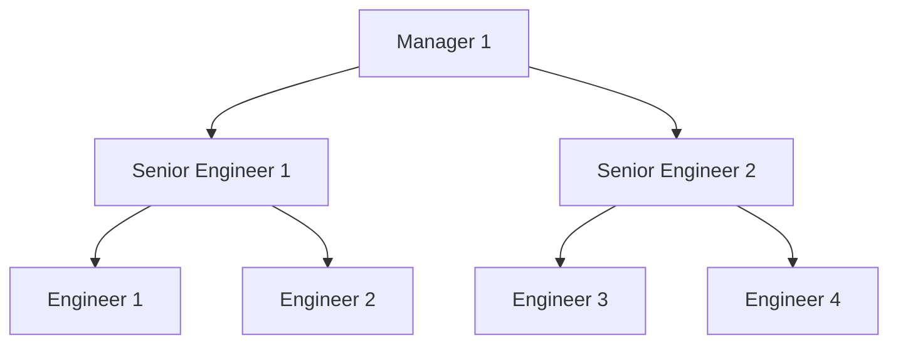
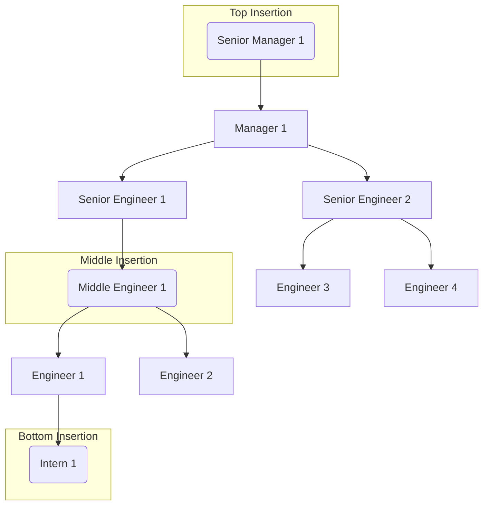
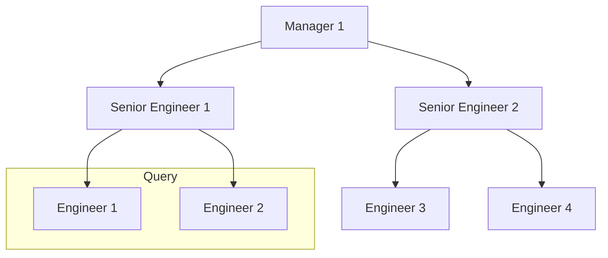

# Scenario
Initially, we have 3 job tier. The lowest tier is Engineer and the highest tier is Manager. Below is the representation of the scenario: 

# Problem
The problem which we want to handle are:
1. Handle new job tier insertion in the top, bottom, and middle of the hierarchy

2. Query to get all member below certain tier 
(ex: All member below Senior Engineer 1)

# Solution

The assumption is, every tier will have maximum slot equals to 10.
|Tier Name                      |Tier Code                  |
|-------------------------------|---------------------------|
|Manager 1			            |1 0 0            			|
|Senior Engineer 1           	|1 1 0						|
|Senior Engineer 2           	|1 2 0						|
|Engineer 1						|1 1 1						|
|Engineer 2						|1 1 2						|
|Engineer 3						|1 2 1						|
|Engineer 4						|1 2 2						|
