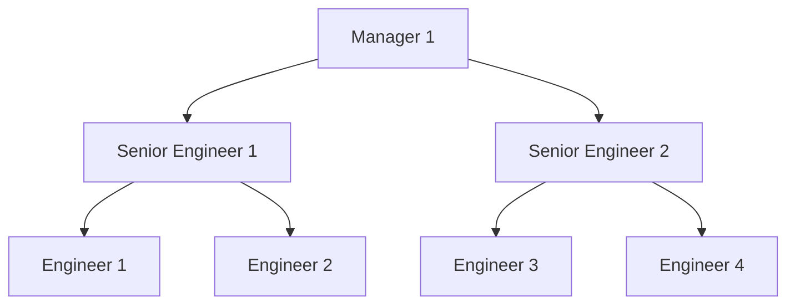
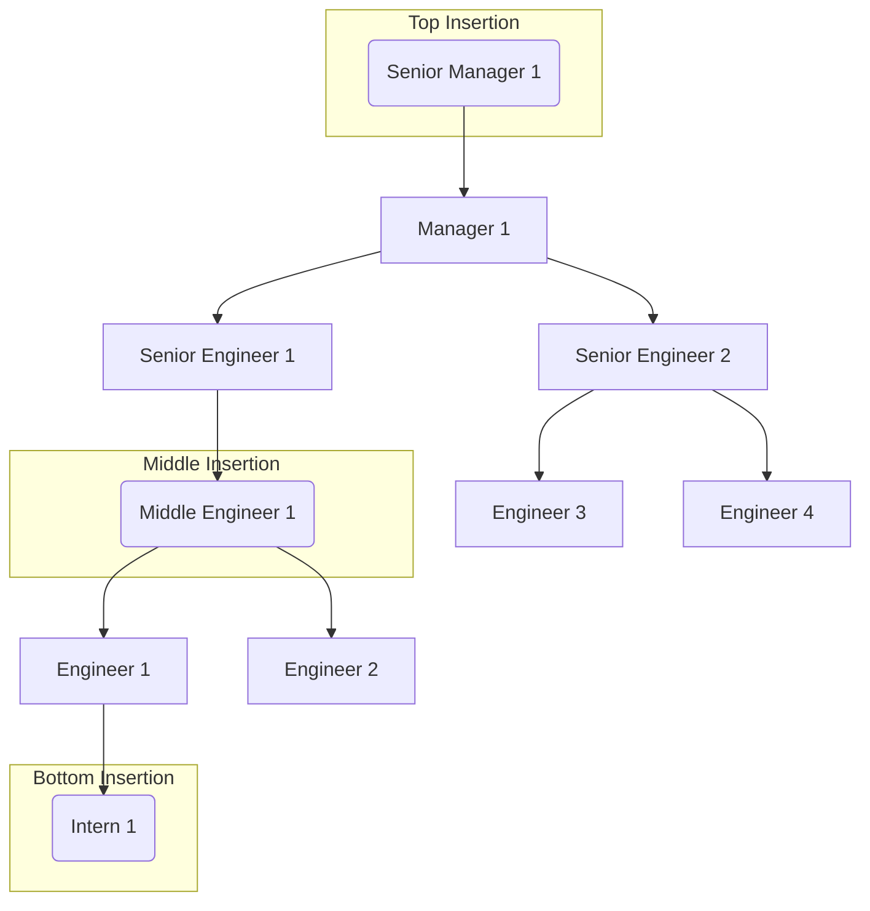
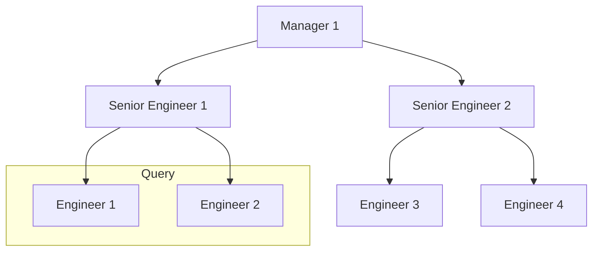

# Scenario

Initially, we have 3 job tier. The lowest tier is Engineer and the highest tier is Manager. Below is the representation of the scenario:

# Problem

The problem which we want to handle are:

1. Handle new job tier insertion in the top, bottom, and middle of the hierarchy

2. Query to get all member below certain tier
   (ex: All member below Senior Engineer 1)

